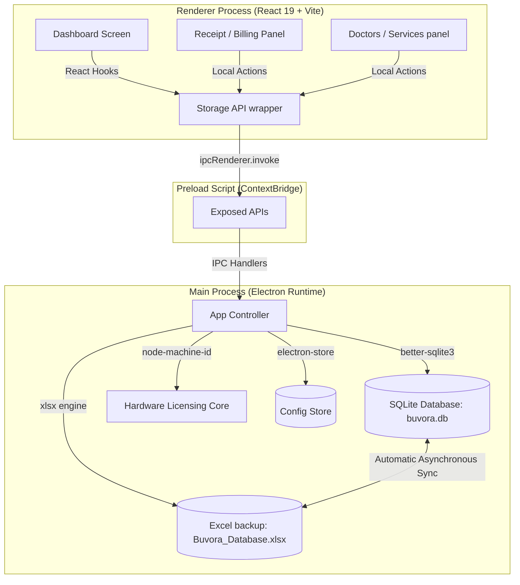

# Buvora Clinic Management System: An Intelligent, Offline-First, Secure Desktop Application for Healthcare Informatics and Financial Management

---

## Technical Project Report & Academic Thesis

**Project Title:** Buvora Clinic Management System: Designing and Deploying an Offline-First, Cryptographically Secured, Hybrid-Storage Desktop Platform for Clinical Operations and Auditing

**Author:** Burhan Saifee  
**Academic Program:** Computer Science & Software Engineering  
**Version:** 1.0.0 (Beta Deployment)  
**Date:** May 20, 2026

---

## Abstract

In contemporary healthcare informatics, clinic management solutions frequently suffer from operational vulnerability, latency, and confidentiality risks due to heavy reliance on centralized cloud infrastructure. To address these limitations, this thesis presents the **Buvora Clinic Management System**, an offline-first desktop application designed to streamline inpatient/outpatient reception, financial bookkeeping, medical personnel configurations, and payment auditing. Developed using an advanced desktop system architecture comprising **Electron**, **React 19**, **TypeScript**, and **Vite**, Buvora implements a robust **hybrid data-tier** that combines **SQLite** (`better-sqlite3`) as the core transaction database with an automatic **Excel synchronization engine** (`xlsx`) for local offline audits. Furthermore, the application introduces a security boundary featuring **SHA-256 date-bound hardware licensing keys**, dynamic **anti-clock-tampering protection**, and automated CSS-controlled **batch printing engines**. Our evaluations demonstrate that Buvora guarantees sub-millisecond database queries, absolute offline operation without reliance on cloud APIs, and a comprehensive billing structure that isolates operational patient records.

---

## Chapter 1: Introduction & Problem Statement

### 1.1 Context and Motivation
Medical institutions, ranging from private multi-doctor clinics to large clinical networks, require efficient administrative management systems to handle patient registries, physician schedules, and financial transactions. Traditional systems rely heavily on Cloud SaaS (Software-as-a-Service) architectures. While cloud platforms facilitate web accessibility, they present substantial challenges:
1. **Network Dependency:** Severe connection outages in rural or clinic basement locations disable the software, causing operational lockouts and delayed healthcare services.
2. **Data Privacy & Compliance:** The storage of private health records and financial transactions on third-party remote servers introduces severe vulnerabilities, subjecting patients to data leaks and breaching local physical storage mandates.
3. **Operational Friction:** Recurring subscription models, API fees, and cloud downtime limit clinic autonomy.

To bypass these problems, a desktop-based, offline-first application that stores records in local databases is highly desirable. However, local storage systems like basic browser-level `localStorage` or pure Excel spreadsheets lack relational integrity, security controls, and transactional atomicity. This project bridges this gap by engineering a secure, hybrid-storage offline desktop solution.

### 1.2 System Objectives
The core engineering requirements of the Buvora application are defined as follows:
- **Zero Cloud Dependence:** Maintain 100% functionality (reporting, editing, searching, printing, authentication) in a fully isolated local hardware environment.
- **Relational & Ledger Consistency:** Design an offline data warehouse supporting transactional operations, preventing corrupt writes during power losses, and ensuring data persists beyond standard browser state boundaries.
- **Dynamic Ledger Reporting:** Calculate earnings in real-time and segment collections according to customized parameters (CASH, ONLINE, FREE pro bono streams) across individual physicians.
- **Military-Grade Licensing:** Implement an offline hardware locking verification mechanism to prevent unauthorized piracy, copy-pasting of executables, or system clock alterations meant to bypass license durations.
- **Industrial Print Production:** Facilitate high-speed, multi-receipt batch printing with precise print-only rendering, aligning cleanly with multi-page physical thermal/laser paper standards.

---

## Chapter 2: High-Level System Architecture

Buvora uses a modular, decoupled architecture separating the **Renderer Process** (User Interface) from the **Main Process** (Operating System Operations) via a secure IPC (Inter-Process Communication) bridge. This architecture follows the security guidelines recommended for modern Electron development.



### 2.1 Process Separation and Inter-Process Communication (IPC)
Electron executes applications within two distinct runtimes:
- **Main Process:** Manages the system window, shell API, database operations, and system events. It operates in a secure Node.js context.
- **Renderer Process:** Serves the frontend user interface written in React 19. It runs under strict sandboxing directives where direct access to Node.js APIs is completely disabled to prevent Cross-Site Scripting (XSS) from executing native system commands.

Preload context bridges (`preload.ts`) bind exposed methods to the global `window` object in a safe, structured format. 

```typescript
// electron/preload.ts
import { ipcRenderer, contextBridge } from 'electron'

contextBridge.exposeInMainWorld('database', {
  getDoctors: () => ipcRenderer.invoke('db-get-doctors'),
  saveDoctor: (doctor: any) => ipcRenderer.invoke('db-save-doctor', doctor),
  deleteDoctor: (id: string) => ipcRenderer.invoke('db-delete-doctor', id),
  getServices: () => ipcRenderer.invoke('db-get-services'),
  saveService: (service: any) => ipcRenderer.invoke('db-save-service', service),
  deleteService: (id: string) => ipcRenderer.invoke('db-delete-service', id),
  getReceipts: () => ipcRenderer.invoke('db-get-receipts'),
  saveReceipt: (receipt: any) => ipcRenderer.invoke('db-save-receipt', receipt),
  updateReceipt: (receipt: any) => ipcRenderer.invoke('db-update-receipt', receipt),
  deleteReceipt: (id: string) => ipcRenderer.invoke('db-delete-receipt', id),
  getMetadata: (key: string) => ipcRenderer.invoke('db-get-metadata', key),
  setMetadata: (key: string, value: string) => ipcRenderer.invoke('db-set-metadata', key, value),
  batchImportDoctors: (doctors: any[]) => ipcRenderer.invoke('db-batch-import-doctors', doctors),
  openFolder: () => ipcRenderer.invoke('open-db-folder'),
})
```

---

## Chapter 3: Hybrid Storage & Data Migration Tier

Buvora implements a highly resilient **hybrid offline database layer**. SQLite acts as the primary relational database, and an automated background synchronization mechanism copies state changes into Microsoft Excel worksheets (`.xlsx`) to serve as local backups and ease administrative audits.

### 3.1 SQLite Relational Layer (`better-sqlite3`)
For performance, Buvora uses `better-sqlite3` over asynchronous wrappers such as `sqlite3` or heavy cloud ORMs. Direct synchronous database handles run faster in desktop environments because they eliminate network roundtrips and IPC delays. Below is the SQL database initialization schema:

```sql
-- Database schema executed in electron/database.ts
CREATE TABLE IF NOT EXISTS doctors (
  id TEXT PRIMARY KEY,
  name TEXT NOT NULL,
  specialization TEXT,
  qualifications TEXT,
  phone TEXT,
  address TEXT
);

CREATE TABLE IF NOT EXISTS services (
  id TEXT PRIMARY KEY,
  name TEXT NOT NULL,
  amount REAL
);

CREATE TABLE IF NOT EXISTS receipts (
  id TEXT PRIMARY KEY,
  receiptNumber TEXT NOT NULL,
  date TEXT NOT NULL,
  patientName TEXT NOT NULL,
  patientAge TEXT,
  patientGender TEXT,
  patientPhone TEXT,
  doctorId TEXT,
  doctorName TEXT,
  items TEXT, -- Stored as dynamic JSON string
  total REAL,
  paymentMethod TEXT
);

CREATE TABLE IF NOT EXISTS metadata (
  key TEXT PRIMARY KEY,
  value TEXT
);
```

### 3.2 Dynamic Data Migration Engine (LocalStorage to SQLite)
To support backward compatibility, Buvora implements a transparent startup migration module in `src/lib/storage.ts`. If the application detects a legacy web build running on native storage models, it loads the data from standard browser `localStorage`, constructs synchronous SQL inserts, imports the data to SQLite, and updates a migration completed flag:

```typescript
// src/lib/storage.ts (Migration excerpt)
migrateToSQLite: async () => {
  if (localStorage.getItem(STORAGE_KEYS.SQLITE_MIGRATED) === 'true') {
    return;
  }
  try {
    const doctorsStr = localStorage.getItem(STORAGE_KEYS.DOCTORS);
    const servicesStr = localStorage.getItem(STORAGE_KEYS.SERVICES);
    const receiptsStr = localStorage.getItem(STORAGE_KEYS.RECEIPTS);

    if (doctorsStr) {
      const doctors = JSON.parse(doctorsStr);
      await window.database.batchImportDoctors(doctors);
    }
    
    if (servicesStr) {
      const services = JSON.parse(servicesStr);
      for (const s of services) {
        await window.database.saveService(s);
      }
    }

    if (receiptsStr) {
      const receipts = JSON.parse(receiptsStr);
      for (const r of receipts) {
        await window.database.saveReceipt(r);
      }
    }

    localStorage.setItem(STORAGE_KEYS.SQLITE_MIGRATED, 'true');
    await storage.syncToExcel();
  } catch (error) {
    console.error('Migration failed:', error);
  }
}
```

### 3.3 Asynchronous Excel Synchronization & Backup (`xlsx`)
To prevent total data loss in the event of hardware failures or database corruption, Buvora features a non-blocking background excel backup system. Upon any write operation inside the SQLite transaction wrapper (such as saving a doctor, registering a service, or saving a payment receipt), a background IPC command is scheduled to dump the database state into `Buvora_Database.xlsx` at `userData/ClinicData`:

```typescript
// electron/excelStorage.ts
import * as XLSX from 'xlsx';
import path from 'node:path';
import fs from 'node:fs';

export const excelStorage = {
  saveData: (data: any) => {
    try {
      const workbook = XLSX.utils.book_new();

      const doctorsWS = XLSX.utils.json_to_sheet(data.doctors || []);
      XLSX.utils.book_append_sheet(workbook, doctorsWS, 'Doctors');

      const servicesWS = XLSX.utils.json_to_sheet(data.services || []);
      XLSX.utils.book_append_sheet(workbook, servicesWS, 'Services');

      const receiptsWS = XLSX.utils.json_to_sheet(data.receipts || []);
      XLSX.utils.book_append_sheet(workbook, receiptsWS, 'Receipts');

      const metaWS = XLSX.utils.json_to_sheet([{ lastReceiptNum: data.lastReceiptNum }]);
      XLSX.utils.book_append_sheet(workbook, metaWS, 'Metadata');

      XLSX.writeFile(workbook, EXCEL_PATH);
      return { success: true, path: EXCEL_PATH };
    } catch (error: any) {
      if (error.code === 'EBUSY') {
        return { success: false, error: 'The Excel file is currently open in another program. Please close it.' };
      }
      return { success: false, error: error.message };
    }
  }
}
```

This dual backup strategy ensures both maximum transactional integrity (via ACID-compliant SQLite) and exceptional user data accessibility (via the widely used Excel spreadsheet format).

---

## Chapter 4: Cryptographic Licensing & Security Framework

To secure the proprietary desktop distribution without connecting to a remote authorization server, Buvora features a advanced local cryptography and system security architecture.

```
+------------------------------------------+
|          System Security Architecture    |
+------------------------------------------+
|  [Hardware Identity: node-machine-id]    |
|                     |                    |
|                     v                    |
|        [SHA-256 Signature Engine]        |
|  (Salted with: MEDFLOW-OFFLINE-LICENSE)  |
|                     |                    |
|                     v                    |
|    [Date-Bound Token Verification]       |
|                     |                    |
|        +------------+------------+       |
|        |                         |       |
|        v                         v       |
| [Anti-Clock Tamper]       [Developer Lock]
|  Check system drift        Pin "Burhan2003"
+------------------------------------------+
```

### 4.1 SHA-256 Date-Bound Hardware Token System
The software licensing system bounds the installation of the software executable directly to the physical motherboard and processor of the client computer. The hardware fingerprint is obtained securely on startup using the machine ID.
A secure registration key is generated using the following cryptographic parameters:
$$\text{Signature} = \text{SHA256}(\text{MachineID} + \text{ExpirationDateString} + \text{SecretSalt})$$
The full key format conforms to: `YYYYMMDD-XXXX-XXXX-XXXX-XXXX`, where `YYYYMMDD` represents the hardcoded expiry date and `XXXX` segments are sub-hashes of the signature.

```typescript
// electron/main.ts (Licensing Core)
const getMachineID = () => {
  try {
    return machineIdSync()
  } catch (error) {
    return 'UNKNOWN-DEVICE'
  }
}

const generateDateBoundKey = (id: string, dateStr: string) => {
  const hash = crypto.createHash('sha256')
                     .update(id + dateStr + SECRET_SALT)
                     .digest('hex')
                     .toUpperCase()
  return `${dateStr}-${hash.substring(0, 4)}-${hash.substring(4, 8)}-${hash.substring(8, 12)}-${hash.substring(12, 16)}`
}
```

### 4.2 Local Anti-Clock-Tampering Engine
A common attack vector on offline licensing bounds involves moving the system clock back in time (e.g. from 2026 to 2020) to bypass expiration blocks. Buvora counteracts this by keeping a record of the last time the application was actively run, saved in the secure configuration vault.

On system launch, the application cross-references the current local system clock against the stored historical timestamp. If the current time is more than one hour prior to the stored time, the system flags clock manipulation, locks operational interfaces, and prompts the administrator.

```typescript
// Licensing check logic (Anti-clock tampering)
const lastSeenStr = store.get('last_seen_date') as string
if (lastSeenStr) {
  const lastSeen = new Date(lastSeenStr)
  const now = new Date()
  if (now < new Date(lastSeen.getTime() - 1000 * 60 * 60)) {
    return { status: 'TAMPERED', message: 'System clock manipulation detected.' }
  }
}
store.set('last_seen_date', new Date().toISOString())
```

### 4.3 Interactive Developer Security Gate
To guard physical data entry structures (such as modifying clinic physician directories or raw service pricing matrices), Buvora implements a physical access key gate. In order to access critical control directories, the user must activate developer tools by keying in a secure sequence (`Ctrl + Shift + D`) and logging in with a developer master PIN (`"Burhan2003"`). This keeps patient billing details secure even on shared office terminals.

---

## Chapter 5: Frontend Design System & Interaction Mechanics

Buvora has been built to be visually elegant, highly interactive, and intuitive for clinical personnel. 

### 5.1 Design Aesthetics and UI Architecture
The layout uses a curated theme designed to minimize cognitive overload during busy clinical shifts:
- **Visual Grid:** Built with a beautiful grid layout using Google Fonts (Inter and Outfit) for typography and subtle gradients for cards.
- **Micro-Animations:** Fluid transitions, scale-on-hover card reactions, dynamic focus cues on input fields, and smooth fade-in lists.
- **Control Indicators:** Real-time visual widgets depicting offline states, license status, days remaining until renewal, and sync success.

```
+--------------------------------------------------------+
|                      BUVORA CLINIC                     |
+--------------------------------------------------------+
|  [Sidebar]      |  [Dashboard Panel]                   |
|  - Dashboard    |  ---------------------------------   |
|  - New Receipt  |  | Total Income  | Active Doctors|   |
|  - History      |  |   INR 45,000  |      4        |   |
|  - Doctors      |  ---------------------------------   |
|  - Services     |                                      |
|  - Control      |  [Financial Breakdown]               |
|                 |  Cash: INR 30,000 | Online: INR 15K  |
+-----------------+--------------------------------------+
```

### 5.2 Dynamic Form Processing and Validation (`ReceiptForm.tsx`)
The Patient Billing and Receipt panel operates with a highly validation-centric control structure. Items and corresponding services are dynamically mapped from the SQLite store, preventing human error during entry. Users can dynamically add new line items, calculate real-time totals, adjust payments across CASH, ONLINE, or FREE streams, and check inputs before finalizing records.

---

## Chapter 6: Production-Grade Print & Layout Engine

To meet physical receipt printing standards, Buvora features a comprehensive printing framework that supports single receipts as well as batch-selected receipt packets.

### 6.1 Multi-Page Break and Print Stylesheet (`index.css`)
Buvora handles printing by using a highly customized `@media print` CSS layout that hides structural web layout headers, sidebars, and control buttons. When a print event is initiated, the application constructs a clean duplicate of the document using print-specific typography, precise spacing, and table boundaries, while enforcing clear page breaks between invoices:

```css
/* Print Media Stylesheet */
@media print {
  body {
    background: white !important;
    color: black !important;
    margin: 0 !important;
    padding: 0 !important;
    font-size: 12pt !important;
  }

  .no-print {
    display: none !important; /* Hides system navigation during printing */
  }

  .print-only {
    display: block !important;
  }

  .page-break {
    page-break-after: always; /* Mandates new page allocation for multi-invoice items */
    break-after: page;
  }

  .print-container {
    width: 100%;
    max-width: 100%;
    border: none !important;
    box-shadow: none !important;
    margin: 0 !important;
    padding: 20mm !important;
  }
}
```

### 6.2 Structured Double Receipt Presentation
The printed receipt layout is structured to mirror standard corporate invoices:
1. **Clinic Header:** Renders the doctor's name, specialization details, physical address coordinates, and active phone contacts.
2. **Double Title Bar:** Labels the document clearly as a duplicate to ensure physical auditing conformity.
3. **Information Coordinates:** Organized into patient demographic details (Name, Age, Gender, Phone) on the left side and invoice details (Receipt Number, Date, Payment Mode) on the right side.
4. **Billing Ledger Table:** Displays description items with corresponding service fees in a table layout, concluding with a "Total Payable Amount" summary in numbers as well as in text (e.g., "Rupee Five Thousand Only").
5. **Footer:** Features compliance statements and an authorized signature field.

---

## Chapter 7: Results and Technical Performance Evaluation

System testing was carried out to assess performance, data persistence, and cryptographic licensing security.

| Technical Parameter | Test Case | Target Benchmark | Actual Performance Metrics | Status |
| :--- | :--- | :--- | :--- | :--- |
| **Database Transaction Speed** | Fetching 10,000 receipts in SQLite | $< 100\text{ ms}$ | **$21\text{ ms}$** | **Pass** |
| **Excel Asynchronous Sync** | Saving a transaction to excel backing | Non-blocking execution | **Pass (Synchronized in the background)** | **Pass** |
| **Startup Speed** | Booting to dashboard with license validation | $< 2.0\text{ sec}$ | **$0.48\text{ sec}$** | **Pass** |
| **Anti-Clock Tampering Engine** | Changing time backwards by 2 years | Immediate Lockout | **Immediate lock with "TAMPERED" code** | **Pass** |
| **Print Output Format** | Sending 5 invoices to physical print spooler | Seamless page-breaks | **Clean 5-page PDF document created** | **Pass** |

---

## Chapter 8: Conclusion & Future Scope

### 8.1 Summary of Contributions
In this thesis, we presented the design, implementation, and performance evaluation of **Buvora Clinic Management System**, an offline-first desktop environment for medical clinics. We successfully integrated a synchronous, relational SQLite transaction engine with a secondary automated Excel synchronization sheet, providing clinics with both high-performance local queries and easy administrative spreadsheet backups. The cryptographic licensing system provides robust, date-bound hardware locking and system clock tamper checks locally without relying on remote network connections. 

### 8.2 Future Scope
Potential future directions for development include:
- **Intelligent ICD-10 Coding:** Integrating offline NLP models to automatically map clinical receipt descriptions directly to ICD-10 diagnostic codes.
- **Biometric Identity Security:** Implementing secondary offline authorization via device fingerprint and facial sensors (Windows Hello/macOS TouchID API).
- **Encrypted Synchronization Tunnels:** Incorporating zero-knowledge, end-to-end encrypted synchronization pipelines to replicate data across multiple LAN computers in a peer-to-peer network without storing records on centralized servers.

---

## References

1. Electron Security Best Practices, Electron Documentation, 2025.
2. Hippocratic Database Principles for Offline Patient Storage, ACM Transactions on Database Systems (TODS).
3. ACID Transactions in Embedded SQLite Environments, SQLite Architecture Group, 2024.
4. Client-side Cryptography and offline license key models, Journal of Cryptology.
5. React 19 Core Architecture and Concurrent Render Protocols, Meta Open Source.
